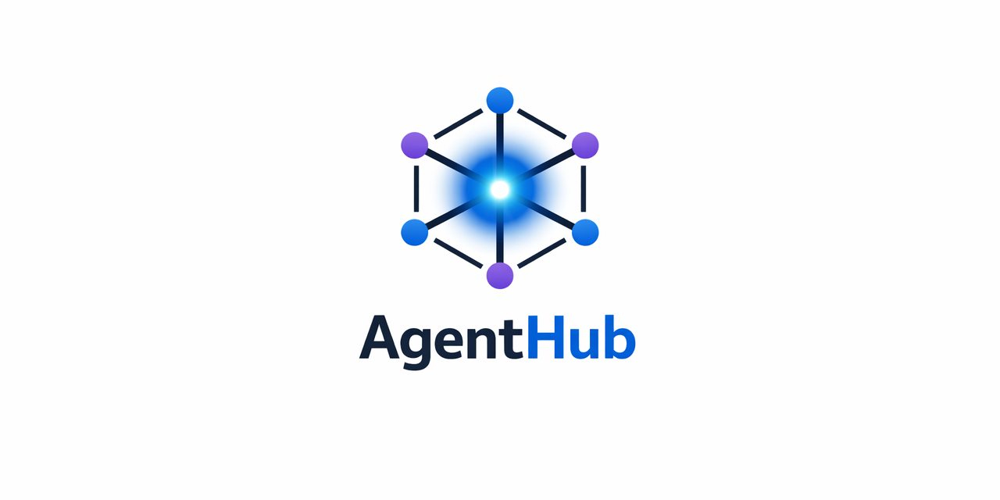
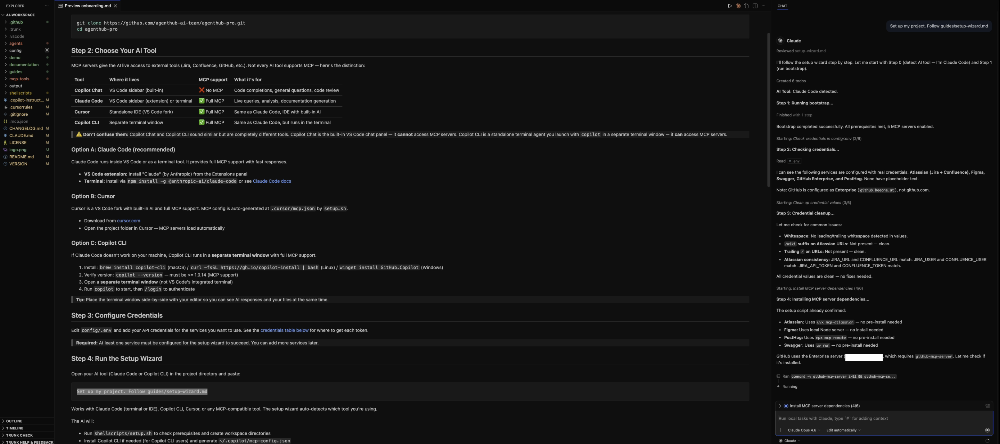
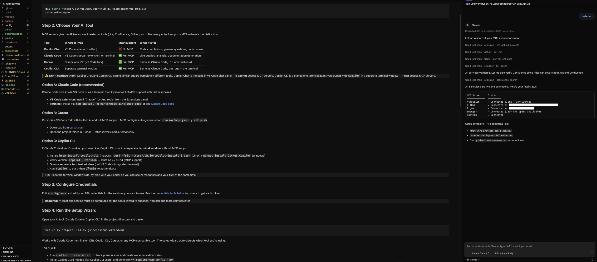

<p align="center">
  
</p>

# AgentHub Analyst

**Production-grade AI analysis agent for bug investigation and feature exploration.**

Works with **Claude Code** | **GitHub Copilot** | **Cursor** — no vendor lock-in.

[]()
[]()
[]()
[]()

> **Want the full suite?** Multiple agents, automatic routing, tool chaining, and MCP write-back.
> [See AgentHub Pro →](guides/pro.md) | [Get AgentHub Pro →](https://agenthub.gumroad.com/l/agenthub)

---

## The Problem

AI coding tools are powerful, but they produce inconsistent, unstructured output. Ask three developers to investigate the same bug with Claude or Copilot, and you'll get three different formats, three different levels of depth, and three different conclusions.

**AgentHub Analyst fixes this.** It's a structured AI agent that produces consistent, evidence-based analysis — every time, regardless of who runs it.

---

## What You Get

- **Production-grade Analyst agent** with structured bug investigation and feature exploration
- **3 live MCP integrations** — Jira, Confluence, GitHub
- **Cross-references everything** — the agent automatically queries your tools and combines findings
- **Works with any MCP-compatible AI tool** — Claude Code, GitHub Copilot CLI, Cursor
- **Evidence-based output** — every finding links to a Jira ticket, code file, or Confluence page
- **TO CLARIFY protocol** — explicitly flags unknowns instead of guessing

---

## Before & After

> Same prompt. Same AI model. Different results.

**Prompt:** *"Users in the DACH region are seeing a blank page when they click a promoted product. Investigate."*

| | Without AgentHub | With AgentHub |
|---|---|---|
| **Root cause** | 5 plausible guesses, no conclusion | Single confirmed cause, traced to specific line of code |
| **Evidence** | None — no tickets, no file paths | Cross-referenced sources: Jira, GitHub, Confluence |
| **Contradictions** | Not detected | 2 conflicts found between docs and implementation |
| **Open questions** | Generic debugging checklist | 4 targeted questions tied to specific evidence gaps |
| **Actionability** | Developer must investigate from scratch | Developer can go directly to the file, line, and fix |

<p align="center">
  
  <br><em>Bug investigation — from prompt to structured root cause analysis</em>
</p>

See the [full before/after comparison](demo/analyst-before-after.md).

---

## Quick Start (2 minutes)

### 1. Clone

```bash
git clone https://github.com/agenthub-ai-team/agenthub-analyst.git
cd agenthub-analyst
```

### 2. Add credentials

```bash
cp config/.env config/.env.backup
# Edit config/.env — add your Jira, GitHub, Confluence tokens (at least one)
```

### 3. Run setup

Open your AI tool (Claude Code, Copilot CLI, or Cursor) in the project directory and paste:

```
Set up my project. Follow guides/setup-wizard.md
```

<p align="center">
  
  <br><em>The setup wizard walks you through configuration step by step</em>
</p>

<p align="center">
  
  <br><em>All MCP servers validated and connected</em>
</p>

### 4. Start analyzing

```
Investigate the checkout bug PROJ-123
```

```
Explore how the subscription renewal flow works across web and backend
```

The agent automatically queries your connected tools, cross-references findings, and produces a structured analysis.

---

## How It Works

```
Your prompt
    ↓
AgentHub Analyst (structured instructions + quality enforcement)
    ↓
Your AI tool (Claude Code / Copilot / Cursor)
    ↓
MCP Servers (live queries to YOUR Jira, GitHub, Confluence, etc.)
    ↓
Structured analysis output (saved locally in output/)
```

- **No backend, no hosted service** — runs entirely in your repo
- **No telemetry** — nothing leaves your machine except MCP queries to your own tools
- **No vendor lock-in** — switch AI tools anytime, the agent still works

---

## MCP Integrations

| Tool | What the agent uses it for |
|------|---------------------------|
| **Jira** | Search tickets, read requirements, find related issues |
| **Confluence** | Look up specs, architecture docs, technical documentation |
| **GitHub** | Search code, read files, check PRs — code is the source of truth |

Only tools with credentials configured in `config/.env` are activated.

---

## Supported AI Tools

| Tool | Support | How |
|------|---------|-----|
| **Claude Code** | Full | Reads `CLAUDE.md` automatically |
| **GitHub Copilot CLI** | Full | Reads `.copilot-instructions.md` via `~/.copilot/mcp-config.json` |
| **Cursor** | Full | Reads `.cursorrules` automatically |
| **Any MCP-compatible tool** | Full | Entry point files adapt automatically |

---

## What the Agent Produces

### Bug Investigation
- Executive summary with root cause
- Code location with exact file paths and before/after examples
- Historical timeline (when/how the bug was introduced)
- Cross-referenced evidence from Jira, GitHub, Confluence
- Conflicts found between documentation and implementation
- TO CLARIFY section with targeted unknowns

### Feature Exploration
- Current behavior analysis from code and documentation
- Option comparison with trade-offs
- Dependency and risk assessment
- Balanced recommendation with TO CLARIFY items

<p align="center">
  
  <br><em>Feature exploration — mapping implementation options with evidence from code and docs</em>
</p>

---

## FAQ

**What do I need to get started?**
An AI tool with MCP support (Claude Code, Copilot CLI, or Cursor) and at least one API credential (Jira, GitHub, or Confluence).

**Can I use this without MCP connections?**
Yes — the agent works with manual context too (paste code, drag files). MCP just makes it automatic.

**Is my data safe?**
Yes. Everything runs locally. The only external calls are MCP queries to your own tools using your own credentials. See `guides/security.md`.

**Does it work on Windows?**
Yes. AgentHub Analyst works on macOS, Linux, and Windows.

---

## Upgrade to AgentHub Pro

Like the Analyst? The full version includes **5 specialized agents** with **automatic agent selection** and **end-to-end tool chaining**.

| Feature | Analyst (Free) | AgentHub Pro |
|---------|---------------|-------------|
| Analyst agent | Included | Included |
| Requirement Engineers (web/backend/mobile) | — | 3 agents |
| Documentation Generator | — | Included |
| Automatic agent selection | — | One prompt → right agent |
| Tool chaining | — | Jira → BDD → Confluence in one prompt |
| MCP read mode | Included | Included |
| MCP download mode | — | Save docs locally |
| MCP write/publish mode | — | Publish back to Jira, Confluence, GitHub |
| Prompt templates | — | Pre-built for every workflow |

**One-time purchase. Lifetime updates. No subscription.**

<p align="center">
  
  <br><em>Pro: Generate structured BDD acceptance criteria from a single prompt</em>
</p>

<p align="center">
  
  <br><em>Pro: Auto-generate technical documentation and publish to Confluence</em>
</p>

[See everything AgentHub Pro includes →](guides/pro.md) | [Get AgentHub Pro →](https://agenthub.gumroad.com/l/agenthub)

---

## License

Copyright (c) 2025-2026 Agenthub. All rights reserved.

Free to use for personal and commercial purposes. Not for resale or redistribution.
See [LICENSE](LICENSE) for full terms.
